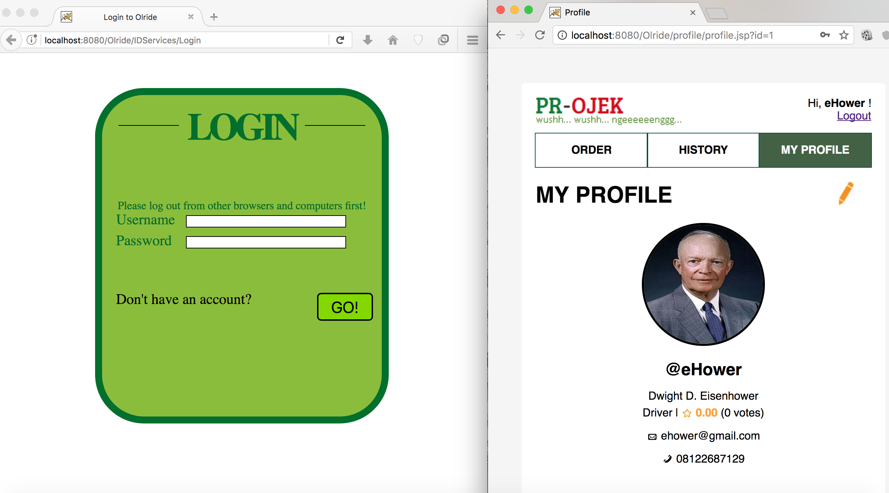
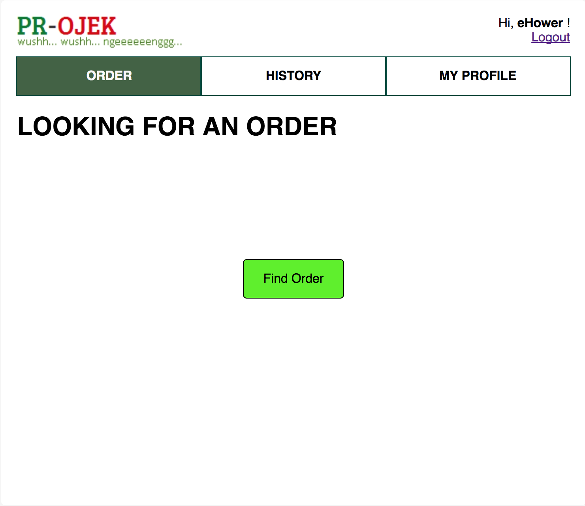
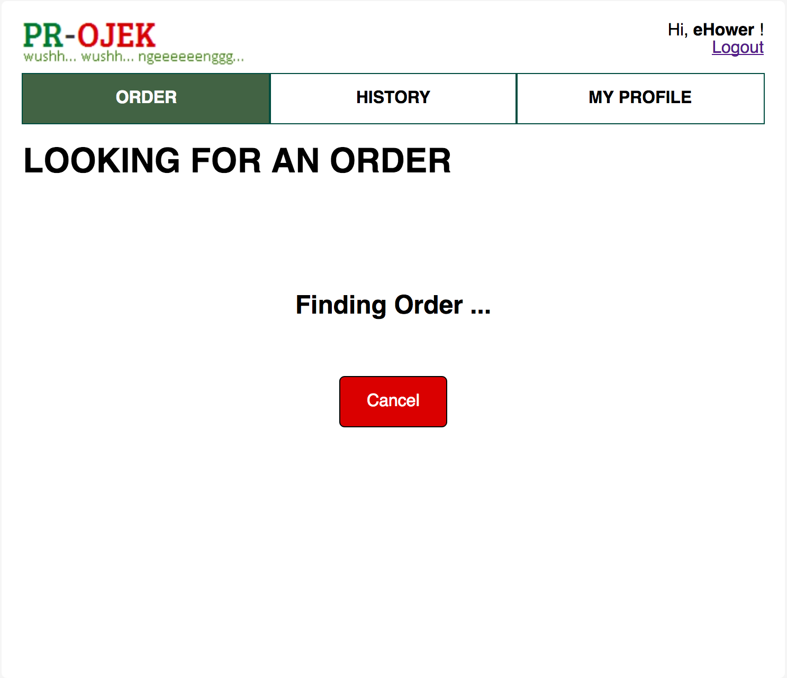
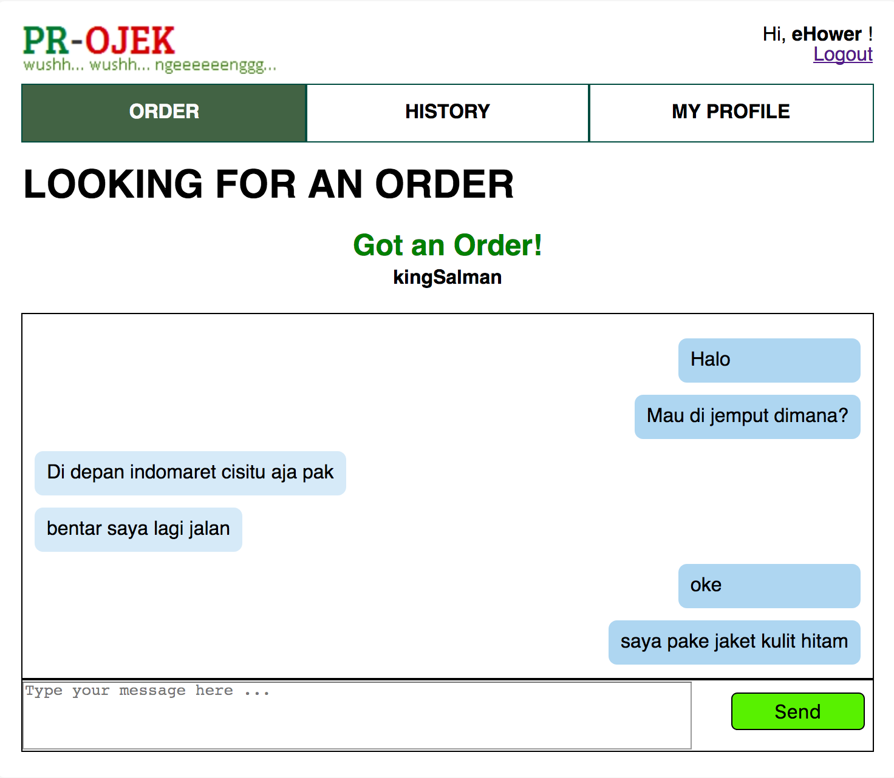
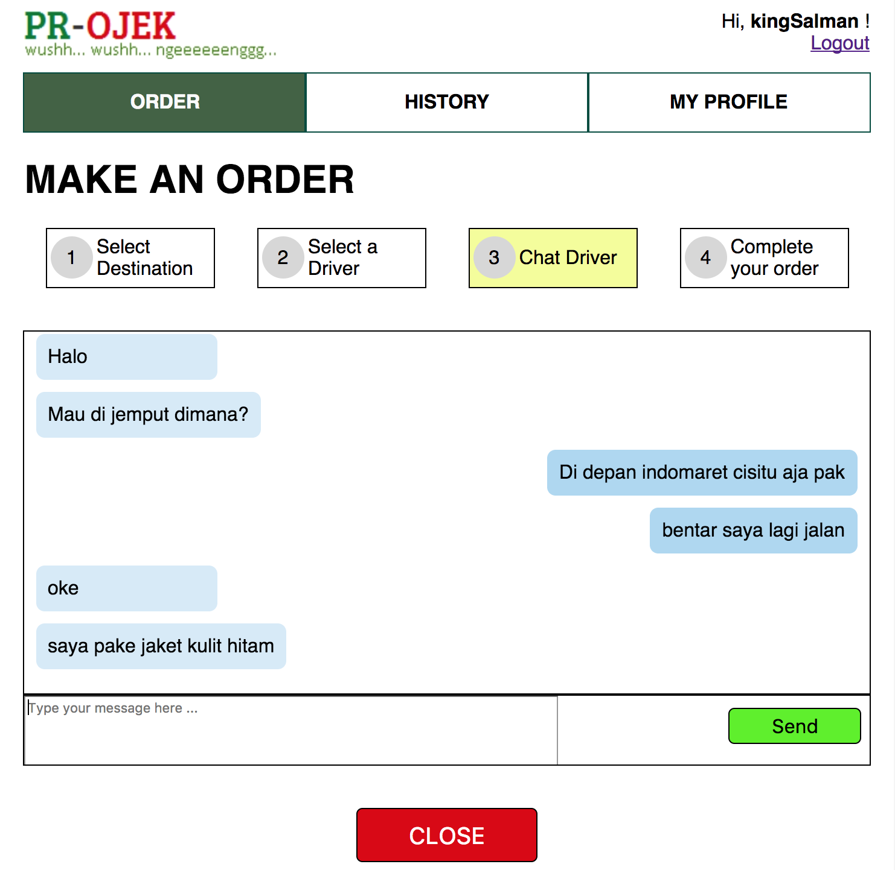

# Tugas 3 IF3110 Pengembangan Aplikasi Berbasis Web

## Deskripsi Singkat
PR-OJEK adalah aplikasi ojek online berbasis web memungkinkan seorang pengguna untuk menjadi penumpang dan/atau driver ojek online. Untuk menggunakan aplikasi ini, seorang pengguna harus melakukan login. Pengguna dapat menjadi penumpang maupun driver pada akun yang sama. Untuk menjadi driver, pengguna harus mengaktifkan opsi menjadi driver pada profilnya.
Seorang driver yang akan mencari order harus mengaktifkan statusnya agar dapat menjadi active ketika ada user lain yang akan mencari ojek. Pengguna dapat saling bertukar pesan dengan driver secara realtime di halaman order chat.

## Anggota Tim
* **13515074 - Akmal Fadlurohman**  
* **13515083 - Muhammad Hilmi Asyrofi**  
* **13515146 - Fadhil Imam Kurnia**  

## Arsitektur Umum

Berikut gambaran arsitektur umum sistem:

### Deskripsi Sistem
Sistem ini merupakan pengembangan lanjutan dari sistem PR-Ojek tahap sebelumnya. Perbedaaan dengan tahap sebelumnya terletak pada perubahan pada fungsionalitas order, peningkatan security, dan tambahan fitur chat yang menghubungkan antara customer dan driver.   
Fitur chat diimplementasikan menggunakan MEAN Stack. REST service untuk keperluan chatting pada sistem ini diimplementasikan dengan Node dan Express. Selain itu, Firebase Cloud Messaging juga digunakan dalam implementasi PR-OJEK pada bagian chat. Data history chat disimpan dalam basis data MongoDB.

## Fungsionalitas Tambahan

### Security
 Tampilan browser yang tidak bisa login

 

### Finding Order

Halaman Order pada Driver

Halaman Order pada Driver Ketika Melakukan Finding Order

Halaman Order pada Driver Ketika Mendapat Order

 

### Chat Pengguna

Halaman Chat Driver Pengguna 

## Asumsi yang Digunakan
1. Diasumsikan kedua client sedang aktif. Aplikasi hanya akan dijalankan pada localhost, sehingga memerlukan 2 browser yang berbeda untuk mensimulasikan client yang berbeda. 
2. Seorang pengguna hanya dapat chatting dengan 1 pengguna lain dalam 1 waktu.
3. Driver hanya dapat menerima satu order dari satu user pada satu waktu.

## Pembagian Tugas

Chat App Front-end :
1. Chatbox : 13515146  
2. Tampilan finding order: 13515146

Chat REST Service:  
1. Fungsionalitas pengiriman pesan : 13515074,13515146  
2. Fungsionalitas interaksi dengan server firebase : 13515146  
3. Fungsionalitas penyimpanan chat history: 13515074
4. Fungsionalitas penyimpanan token FCM pengguna: 13515074
5. Fungsionalitas membuka chatroom untuk driver dari server side: 13515074
6. Fungsionalitas menutup chatroom untuk driver dari server side: 13515146 

Fitur security (IP, User-agent) :
1. Validasi user agent dan ip : 13515074

Readme.md: 13515083

## About

Asisten IF3110 2017

Ade | Johan | Kristianto | Micky | Michael | Rangga | Raudi | Robert | Sashi

Dosen : Yudistira Dwi Wardhana | Riza Satria Perdana | Muhammad Zuhri Catur Candra
